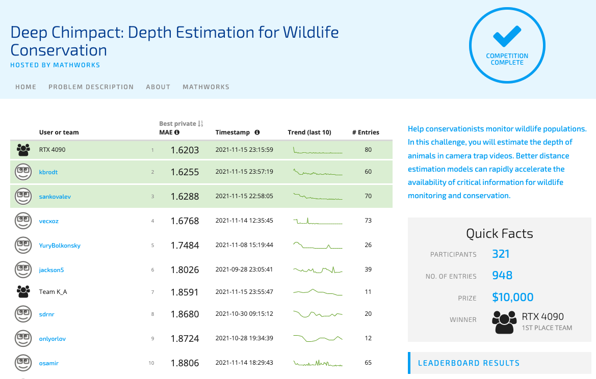
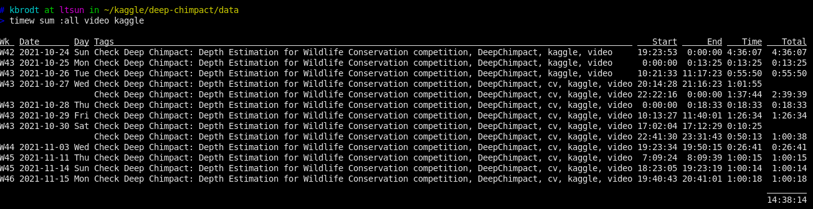
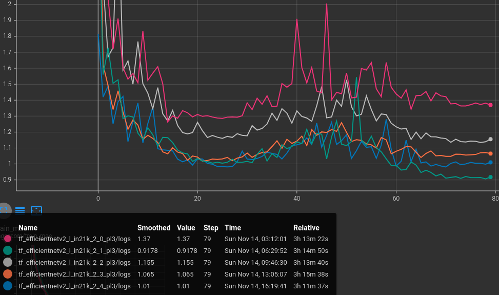

# Deep Chimpact: Depth Estimation for Wildlife Conservation

[Deep Chimpact: Depth Estimation for Wildlife Conservation](https://www.drivendata.org/competitions/82/competition-wildlife-video-depth-estimation/page/390/)

[2nd
place](https://www.drivendata.org/competitions/82/competition-wildlife-video-depth-estimation/leaderboard/)
out of 321 participants with 1.6255 MAE score (top1 1.6203).

Leaderbord



Time spent



## Prerequisites

- GNU/Linux
- [Python 3](https://www.python.org/)
- [PyTorch 1.10](https://pytorch.org/)
- [NVIDIA apex](https://github.com/NVIDIA/apex)
- 5 GPUs with 32GB VRAM (e.g. DGX station with Tesla V100)

## Usage

### Data preprocessing

Download data from the competition link into `data` folder and run

```bash
sh ./preprocess.sh
```

### Training

```bash
sh ./dist_run.sh
```

It will take about 1 day on 5 GPUs.

### Inference

You can download pretrained models
[here](https://disk.yandex.com/d/fyxXDUq9dNzmkw) and extract into `weights`
folder (note that yandex disk do not allow to download as one file, so you must
download it one by one).

```bash
sh ./test.sh
```

It takes ~40 minutes on 1 GPU V100 32 GB.

## Approach

I've trained `efficientnetv2_l` CNN models with MAE loss. The inputs to the
model are 5 frames stacked channelwise: 2 frames in the past, 1 -- present for
which the dense estimation is made and 2 -- future. The frames are downsampled
to `270x480`. The output is a scalar -- a distance. The model is trained with
heavy augmentations for 80 epochs with `AdamW` optimizer and
`CosineAnnealingLR` scheduler. Finaly, I ensembled models from different folds
using the simple average. These predictions are used for training new models
for pseudolabeling.

Typical learning curves of the model (MAE score on 5 folds)



## Highlights

- `efficientnetv2_l` model
- 10 folds by video
- 5 chennelwise stacked frames with `270x480` size: 2 frames in the past, 1 -- present and 2 -- future
- MAE loss
- Heavy augmentations
- 80 epochs, 32 batch size
- `AdamW` optimizer with `1e-3` learning rate and `5e-6` weight decay
- `CosineAnnealingLR` scheduler with period of 25 epochs
- Ensemble of models (averaged distance)
- Pseudolabeling
